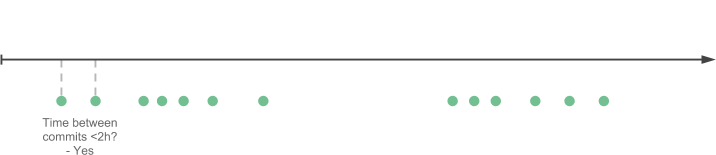

# git-hours

Estimate time spent on a git repository.

Port to Python of the `git-hours` project by <https://github.com/kimmobrunfeldt/git-hours>.

## Example use

Time spent on developing [SQLAlchemy](https://github.com/sqlalchemy/sqlalchemy.git):

```javascript
➜  bootstrap git:(master) git-hours
{

  ...

    'total': {
        'hours': 18276.158333333322,
        'commits': 15504,
    },
}
```

From a person working 8 hours per day, it would take more than 10 years to build Bootstrap.

*Please note that the information is not be accurate enough to be used in billing.*

## Install

    $ pipx install git-hours


## How it works

The algorithm for estimating hours is quite simple. For each author in the commit history, do the following:

<br><br>


*Go through all commits and compare the difference between
them in time.*

<br><br><br>



*If the difference is smaller or equal then a given threshold, group the commits
to a same coding session.*

<br><br><br>


*If the difference is bigger than a given threshold, the coding session is finished.*

<br><br><br>


*To compensate the first commit whose work is unknown, we add extra hours to the coding session.*

<br><br><br>


*Continue until we have determined all coding sessions and sum the hours
made by individual authors.*

<br>

The algorithm in [~30 lines of code](https://github.com/kimmobrunfeldt/git-hours/blob/8aaeee237cb9d9028e7a2592a25ad8468b1f45e4/index.js#L114-L143).

## Usage

In root of a git repository run:

    $ git-hours

